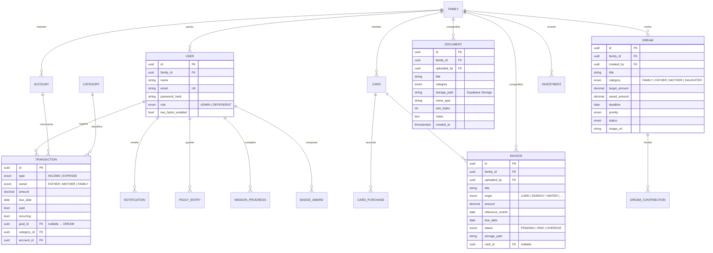

# Family Finance — Arquitetura da Solução

## 1. Visão geral

O que está neste repositório é o **protótipo funcional de alta fidelidade**
(HTML/CSS/JS puro, persistência em `localStorage`), que valida UX, identidade
visual, permissões e os fluxos de upload de documentos e faturas. A arquitetura
abaixo descreve a evolução para produção.

```
┌─────────────────────────────────────────────────────────────┐
│                        CLIENTES                              │
│   Web (Next.js PWA)  ·  Mobile (PWA instalável)              │
└──────────────────────────┬──────────────────────────────────┘
                           │ HTTPS / JSON
┌──────────────────────────▼──────────────────────────────────┐
│                    API — NestJS (Node.js)                    │
│  Módulos: auth · users · transactions · accounts · cards    │
│  documents · invoices · dreams · education · notifications  │
│  insights (IA) · reports                                     │
└───────┬───────────────┬───────────────┬─────────────────────┘
        │               │               │
┌───────▼──────┐ ┌──────▼───────┐ ┌────▼─────────────────────┐
│ PostgreSQL   │ │ Supabase     │ │ Serviços externos        │
│ (Prisma ORM) │ │ Storage      │ │ FCM push · e-mail (SES)  │
│              │ │ (docs/       │ │ WhatsApp Cloud API (opt) │
│              │ │  faturas)    │ │ API Claude (insights)    │
└──────────────┘ └──────────────┘ └──────────────────────────┘
```

## 2. Stack

| Camada | Tecnologia |
|---|---|
| Frontend | Next.js + React + TypeScript + Tailwind CSS + Shadcn/UI + Recharts |
| Backend | NestJS (Node.js), arquitetura modular por domínio |
| Banco | PostgreSQL + Prisma ORM |
| Arquivos | Supabase Storage (buckets privados `documents/` e `invoices/`, URLs assinadas) |
| Auth | JWT + refresh token, OAuth opcional, 2FA TOTP |
| Notificações | Firebase Cloud Messaging, e-mail, WhatsApp Cloud API (configurável) |
| IA | Camada de regras + API Claude para insights em linguagem natural |

## 3. Modelo de dados (ERD)



Regras de integridade importantes:
- `DOCUMENT` e `INVOICE` pertencem à **família** (não a um usuário) — é isso que
  torna as duas áreas comuns ao pai e à mãe; `uploaded_by` registra a autoria.
- RLS (row-level security): dependentes não têm `SELECT` em transações, contas,
  cartões, investimentos, documentos e faturas.
- Todo lançamento tem `owner` (pai/mãe/família) para relatórios individuais e consolidados.

## 4. APIs (contratos principais)

```
POST   /auth/login · /auth/refresh · /auth/2fa/verify
GET    /dashboard/summary            (admin)
GET    /transactions?owner=&tag=&month=
POST   /transactions                 (admin)
PATCH  /transactions/:id/pay
GET    /documents?category=          (admin — escopo família)
POST   /documents  (multipart)       (admin)
GET    /documents/:id/download-url   (URL assinada, expira em 5 min)
GET    /invoices?status=             (admin — escopo família)
POST   /invoices (multipart)         (admin)
PATCH  /invoices/:id/pay
GET    /dreams        POST /dreams   (dependente: apenas categoria própria)
GET    /education/missions · /education/badges · /piggy
GET    /insights                     (regras + IA)
GET    /reports/:type?format=pdf|xlsx|csv
```

## 5. Segurança & LGPD
- Senhas com Argon2id; JWT curto (15 min) + refresh rotativo; 2FA TOTP.
- Criptografia TLS 1.3 em trânsito; AES-256 em repouso (banco e storage).
- Logs de auditoria imutáveis para ações financeiras e uploads.
- Backups diários com retenção de 30 dias e teste de restauração mensal.
- LGPD: consentimento explícito, exportação de dados pessoais, exclusão sob demanda.

## 6. Plano de testes
| Nível | Ferramenta | Cobertura alvo |
|---|---|---|
| Unitários | Vitest / Jest | serviços e cálculos (tags, totais, projeções) |
| Integração | Supertest + banco efêmero | contratos da API e RLS por perfil |
| E2E | Playwright | login por perfil, upload de documento/fatura, CRUD de sonhos |
| Acessibilidade | axe-core | AA em ambos os temas |

## 7. Plano de implantação
1. **Protótipo (este repo):** estático — GitHub Pages / Vercel, sem backend.
2. **MVP produção:** Vercel (front) + Fly.io ou Railway (API) + Supabase (Postgres + Storage + Auth).
3. **Observabilidade:** Sentry (erros), logs estruturados, uptime check.
4. **CI/CD:** GitHub Actions — lint, testes, build, deploy por branch.
